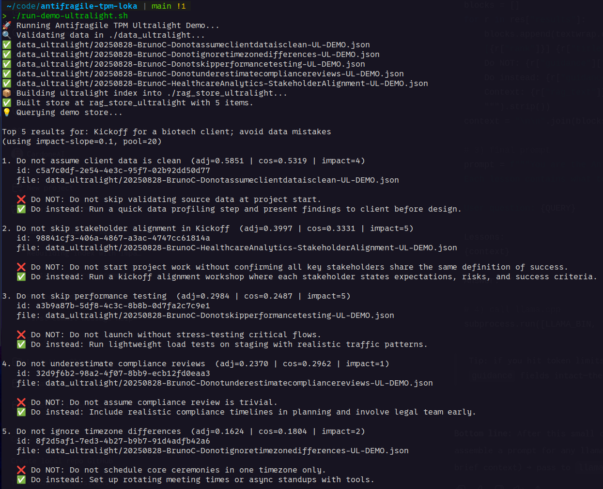

# Antifragile TPM (Loka): An Ultra-Light Local RAG POC, Knowledge and Playbook for TPMs at Loka

**Antifragile TPM** is an experiment in applying Nassim Taleb’s *Antifragile* principles to Technical Project Management at **Loka**.  

Instead of chasing “best practices,” we capture **what not to do** and systematize lessons from failure, fragility and volatility — turning them into guardrails, options, and playbooks for TPMs.  

> “What kills me makes others stronger.” — Nassim Nicholas Taleb

## Why This Matters

Loka projects often operate in **Extremistan** like biotech, life sciences and other high-complexity domains where rare events dominate outcomes.  

This repo is not just a knowledge base.  
It is a **living antifragile system**:  
- a repository of failures and lessons (negative knowledge),  
- a set of local-first RAG tools to surface them at the right time,  
- and a [practical playbook](./playbook/playbook-readme.md) TPMs can apply immediately.  

Each contribution reduces fragility, expands optionality and strengthens every future project.

---

## 🔑 Core Idea

Most PM frameworks optimize around prediction and control.  
**I propose an antifragile inspoired way**:

- **Via Negativa** — start with what NOT to do. Subtract fragility before adding complexity.  
- **Optionality** — keep multiple paths alive; cap downside, preserve upside.  
- **Benefiting from Mistakes** — design systems where small errors improve resilience.  
- **Questioning Assumptions** — hunt for absolutes; one counterexample can collapse the system.  
- **Fragility Assessment** — measure fragility vectors and eliminate ruin exposure before optimizing.  

This repo provides both the **infrastructure (RAG pipelines)** and the **guidance (playbook)** to make TPMs stronger under stress.

---

## 📂 Repo Structure

```
data/                 # Full-schema antifragile lessons (JSON)
data_ultralight/      # Ultra-light lessons (fast capture)
rag.py                # Full RAG pipeline (structured lessons)
rag-ultralight.py     # Ultra-light RAG pipeline (minimal schema)
rag_store*/           # FAISS indices for RAG
llama_rag_prompt.py   # Pipe RAG into local Llama.cpp models
playbook/             # Loka Antifragile TPM Playbook (Markdown guides)
docs/                 # Notes, diagrams, references
tests/                # Query and pipeline test cases
setup.sh              # One-time setup script
run-demo*.sh          # Demo scripts (standard & ultralight)
```

---

## 🚀 Quick Start

Clone and bootstrap:

```bash
git clone https://github.com/rabb1tl0ka/antifragile-tpm-loka.git
cd antifragile-tpm-loka
chmod +x setup.sh run-demo*.sh
./setup.sh
./run-demo-ultralight.sh
```

This will validate lessons, build a FAISS index and run a sample antifragile query.

---

## 🧪 Example Query

```bash
python3 rag-ultralight.py query   --store ./rag_store_ultralight   --q "Kickoff for a biotech client; avoid data mistakes" -k 5
```

**Sample Output:**


---

## 📖 Playbook

The **[Loka Antifragile TPM Playbook](./playbook/playbook-readme.md)** translates antifragile principles into practical practices for TPMs:

1. [Via Negativa – subtraction as power](./playbook/01-via-negativa.md)  
2. [Optionality – asymmetric bets](./playbook/02-optionality.md)  
3. [Benefiting from Mistakes – local failures → global strength](./playbook/03-benefiting-from-mistakes.md)  
4. [Questioning Assumptions – exposing Black Swan fragility](./playbook/04-questioning-assumptions.md)  
5. [Fragility Assessment – mapping ruin exposure](./playbook/05-fragility-assessment.md)  

---

## 🛠️ Contributing

1. TPMs submit a JSON file describing a mistake, something that went wrong or any kind of fragility discovered in a project (`data/` or `data_ultralight/`).  
2. Run `validate` to check schema compliance.  
3. Run `build-index` to auto-generate narratives and build the FAISS store.  
4. Use `query` to retrieve relevant lessons when planning or reviewing projects.  

Contributions = negative knowledge = stronger TPMs.  

---

## 📜 License

[MIT](LICENSE) – Open for experimentation, learning, and adaptation.  
